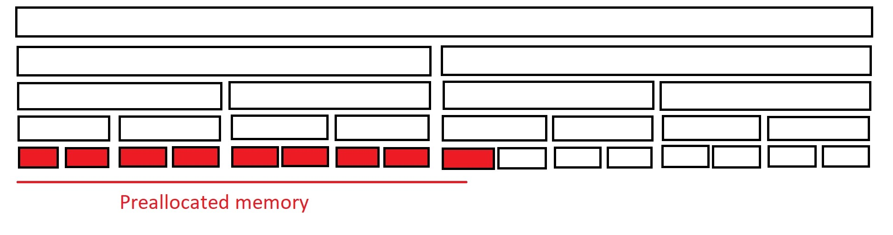

Buddy allocation design
=======================

The buddy allocation algorithm implemented in this project is described in 
this `blog post <http://bitsquid.blogspot.com/2015/08/allocation-adventures-3-buddy-allocator.html>`_. 
It needs to be given a block to manage and its size. The algorithm's main 
characteristics are:

   * somewhat complex initialisation of the managed block
   * simple allocation and deallocation methods due to the (conceptual) inner structure of the block achieved with the initialisation
   * low memory consumption (from the block itself) for bookkeeping purposes
   * allocation and deallocation in logarithmic time (in terms of the block size)

Ensuring correct alignment
--------------------------

One of the most important things for the proper initialisation of the block 
is a power of two size. Clients may pass in blocks whose size is not a power 
of two, however. This can be solved by logically extending the block from 
its left end. Thus, we'll have to work with a logical block start and size.
  
As discussed in the blog post, the block can be conceptually broken into 
many blocks, the smallest of which are called **leaves**. If the block 
needs to be logically extended, the leaves in the extended part of the 
block are just **logical leaves**. The ones that are part of the actual 
block are **physical leaves**. The leaf size is a (power of two) constant 
that is chosen carefully by keeping in mind that leaves will be the 
smallest blocks to be allocated and will need to be able to fit two 
(aligned) pointers.
  
While reading the following paragraphs, refer to the illustration below 
them.
  
Let us denote the leaf size with L, alignof(std::max_align_t) with M and 
**assume** that M ≤ L. Let's assume we are given a block starting at 
address A and let B ≥ A be the first address within the block which is 
aligned to M. Let d = B - A, d < M. Let k be the number of leaves fitting 
in the block starting at B and S = k * L be the size of the block made up 
from the leaf blocks. The (physical) leaf blocks are thus at addresses 
B + i * L, for 0 ≤ i < k. Let S' = S + d > 0 * L, that is, S' = k' * L, 
where k' = k + (d > 0). S' takes into consideration the possible offset for 
alignment, thus potentially introducing a logical leaf.
  
Let N (the logical size) be the first power of two which is ≥ S' and 
D = N - S'. It is not hard to prove that there is a natural number t such 
that D = t * L. Let C = B - (d > 0) * L and Z = C - D be the logical start 
of the block.
  
The size of the block between Z and C is D = t * L so this block is broken 
up into (logical) leaves with addresses Z + i * L, for 0 ≤ i < t. The size 
of the block between C and B (if any) is exactly L. So, starting from Z, we 
have n = t + k' leaves with addresses Z + i * L, for 0 ≤ i < n. Since M and 
L are powers of two and M ≤ L, we know that L / M is a positive integer, 
that is, M "fits" exactly L / M times into L and there is no space left. 
Thus, since B is aligned to M, each of the leaf blocks is also aligned to M. 
Since each address returned by the allocator is that of a leaf, we know 
that the allocator always returns blocks alligned to M.
  

  
As we'll see later, in the average case d will not be big enough to store 
useful information so we'll act as if it is 0.
  
Bookkeeping data structures
---------------------------

The implementation uses one implicit data structure - the binary tree 
formed by splitting the (logical) block into smaller ones, and three 
explicit data structures:

   * a sequence of free lists, one list for each level in the tree
   * a bit map storing whether the non-leaf blocks in the tree are split
   * a bit map storing a bit per buddy pair which holds the value is_free(buddy_A) XOR is_free(buddy_B)
  
The free lists are implemented to store a single pointer to the first block 
in the list. Their alignment requirement will thus be ≤ M and the total 
size required for the sequence of lists will be ≥ levels_count * pointer_size.
  
The bit maps are simply sequences of bytes so they can be stored at any 
address. The formula by which their size is computed is illustrated in the 
following table.
  
========  ================  ===============
 Levels    Split map size    Free map size
   l         2^(l-1) - 1       2^(l - 1)
========  ================  ===============
   2             1                2
   3             3                4
   4             7                8
   5             15               16
========  ================  ===============
  
Both maps are allocated 2^(l - 1) bits because the extra bit for the split 
map would not require an extra byte and the maps would need an exact number 
of bytes either way to be able to access the last bits safely.
  
Since the memory lost in the beginning of the physical block (due to 
alignment) will be 7-8 bytes on the average (for a M = 16), it would be 
insufficient to store the lists as a typical pointer size would be 4 or 8 
bytes.
  
The 8 bytes could be split into 2 groups of 4 bytes and given to the bit 
maps. Each bit map would have room for at most 32 bits. With half a bit per 
block, this means the allocator could have at most 64 blocks so 32 leaves, 
giving the total size of 4KB for a leaf size of 128B. So if we need to 
manage more than 4KB, this won't fit the two bitmaps either. Since the 
allocator works well for big allocations, the total size is expected to be 
much more than that. Thus, this memory will be wasted.
  
The memory lost at the end of the physical block (because it does not fit a 
whole leaf) will be about 63-64 bytes on average (for a leaf size of 128B). 
With 64 bytes, we could fit 8 pointers for the free lists at the end of the 
block (on 64-bit platforms). As the address is aligned to M, they might 
actually fit in there. But 8 lists means 8 levels so the leaves will be 
2^7 = 128. This gives us a total size of at most 16KB which is not that 
much. The lists should better be stored at the start of the (aligned) 
physical block.
  
We could split the 64 bytes into two groups of 32 bytes each and give them 
to the bit maps. This means each bit map would have 256 bits, so we could 
have at most 256 leaves. This gives us a total size of at most 32KB. So for 
blocks with size ≤ 32KB, the two bit maps could be stored in this memory. 
Additionally, for a small number of levels (say less than 10), the bit maps 
would require less memory than the lists, so they could fit in less memory 
than the average 64 bytes. The benefits of storing the bit maps in this 
memory is that it won't be wasted and the two maps could fit into a single 
cache line (as the typical size is 64 bytes).
  
And since the bit maps have no issues with alignment, we could fit them 
right after the lists. This means we could try to store them after the 
last leaf, and if we can't, we could fall back to storing them after the 
lists. Separating the bit maps so that at least one of them is stored at 
the end of the block would probably complicate things too much.

The resulting layout of the bookkeeping data structures is illustrated in 
the following image. Of course, the bit maps are stored in exactly one of 
the places in the illustration.
  

  
Initialising the data structures
--------------------------------

The memory in which the bookkeeping data structures are stored is now known 
but how are they initialised?
  
Initially, the lists are empty, all bits in the split map are down and all 
bits in the free map except the one for the block with index 0 are down. 
Remember that this is the "root" block and thus has no buddy so its bit 
stores the value is_free(block).
  
Then, we compute the total size of the memory to be preallocated. That is, 
the memory formed by the logical leaves plus the wasted memory for 
alignment and the memory needed to store the lists and potentially bit maps. 
The allocator will be initialised as though this memory was allocated in 
leaves and it will not be freed.
  
This process is pretty simple. First, the leaves are allocated by flipping 
their free bits accordingly. Then, their parent blocks are allocated in a 
similar way but are also marked as split. Finally, the free blocks from the 
lower level are inserted into the corresponding free list. This is then 
repeated for the parents' parents and so on, as illustrated below.
  

  

  

  
Inserting blocks into a list
----------------------------

Remember that each address of a block in the allocator is aligned to M. 
The implementation assumes that std::uintptr_t is a built-in type so its 
alignment requirement is ≤ M. Then, it can be placed at the start of any 
of the blocks. So even if M is 64, for a leaf size of 128, we would be able 
to split the leaf blocks in two and store an std::uintptr_t in each half 
as std::uintptr_t will surely fit into 64 bytes.
  
Because std::uintptr_t is assumed to be a built-in type, it is also
read from (written to) raw memory directly.
  
Time and space complexity
-------------------------

For time complexity let's assume the managed block has size **n** and **N** 
is the first power of two ≥ **n**. The algorithm's initialisation takes time 
O(N) while allocation and deallocation take time O(logN).
  
In terms of space complexity, we are interested in what percentage of the 
managed block is used for bookkeeping purposes. Lets assume our block is 
aligned to M and its size is S, that is, we'll assume the managed block is 
already aligned and its size is a multiple of the leaf size. If that is not 
the case, the percentage will be just a bit smaller.
  
Let's also assume that the free list size (in bytes) is LS. We compute the 
total size TS to be the first power of two ≥ S, the levels count 
LC = log2(TS / LEAF_SIZE) + 1, where LEAF_SIZE = 128. As the lists are 
placed in the beginning, the size required for them is LsS = LC * LS. The 
size of a bit map is BMS = size_in_bytes(2^(LC - 1)). We'll assume the bit 
maps are stored right after the lists and not in the "lost" memory after 
the last physical leaf as the percentage would be even smaller otherwise.
  
Since we place the maps right after the lists, the required size for both 
maps is BMsS = 2 * BMS. The preallocated size is then PS = LsS + BMsS. We 
are then interested in:

   * whether PS < S
   * LC
   * LsS
   * BMsS
   * PS
   * PS as percentage of S
   * PS as percentage of TS
  
The actual size must be at least LEAF_SIZE (otherwise there won't be 
anything to allocate) so we start our measurement from there. As at least 
two levels are required for proper initialisation, this won't work, but we 
could start with 129 which will give us two logical leaves and still a 
single physical one where to store the data structures. Each size < 256 
would give us two logical leaves which we already tried to fit into one 
physical leaf. That's why we can then measure for 256. We continue for each 
multiple of LEAF_SIZE.
  
The following table shows the results for LS = 8.
  
=======  ======  ========  ============  ===========  ===================  ===========  ===================
 Size     Fits    Levels    Lists size    Maps size    Preallocated size    % of size    % of logical size
=======  ======  ========  ============  ===========  ===================  ===========  ===================
 128      False   NA        NA            NA           NA                   NA           NA
 129      True    2         16            2            18                   13.95        7.03
 256      True    2         16            2            18                   7.03         7.03
 384      True    3         24            2            26                   6.77         5.07
 512      True    3         24            2            26                   5.07         5.07
 640      True    4         32            2            34                   5.31         3.32
 768      True    4         32            2            34                   4.42         3.32
 896      True    4         32            2            34                   3.79         3.32
 1024     True    4         32            2            34                   3.32         3.32
 1152     True    5         40            4            44                   3.81         2.14
 1280     True    5         40            4            44                   3.43         2.14
 1408     True    5         40            4            44                   3.12         2.14
 1536     True    5         40            4            44                   2.86         2.14
 1664     True    5         40            4            44                   2.64         2.14
 1792     True    5         40            4            44                   2.45         2.14
 1920     True    5         40            4            44                   2.29         2.14
 2048     True    5         40            4            44                   2.14         2.14
 2176     True    6         48            8            56                   2.57         1.36
 2304     True    6         48            8            56                   2.43         1.36
 2432     True    6         48            8            56                   2.30         1.36
 2560     True    6         48            8            56                   2.1875       1.36
 2688     True    6         48            8            56                   2.08         1.36
 2816     True    6         48            8            56                   1.988        1.36
 2944     True    6         48            8            56                   1.90         1.36
 3072     True    6         48            8            56                   1.82         1.36
 3200     True    6         48            8            56                   1.75         1.36
 3328     True    6         48            8            56                   1.68         1.36
 3456     True    6         48            8            56                   1.62         1.36
 3584     True    6         48            8            56                   1.56         1.36
 3712     True    6         48            8            56                   1.50         1.36
 3840     True    6         48            8            56                   1.45         1.36
 3968     True    6         48            8            56                   1.41         1.36
 4096     True    6         48            8            56                   1.36         1.36
=======  ======  ========  ============  ===========  ===================  ===========  ===================
  
For LS = 16:
  
=======  ======  ========  ============  ===========  ===================  ===========  ===================
 Size     Fits    Levels    Lists size    Maps size    Preallocated size    % of size    % of logical size
=======  ======  ========  ============  ===========  ===================  ===========  ===================
 128      False   NA        NA            NA           NA                   NA           NA
 129      True    2         32            2            34                   26.35        13.28
 256      True    2         32            2            34                   13.28        13.28
 384      True    3         48            2            50                   13.02        9.76
 512      True    3         48            2            50                   9.765        9.76
 640      True    4         64            2            66                   10.31        6.44
 768      True    4         64            2            66                   8.593        6.44
 896      True    4         64            2            66                   7.366        6.44
 1024     True    4         64            2            66                   6.445        6.44
 1152     True    5         80            4            84                   7.291        4.10
 1280     True    5         80            4            84                   6.562        4.10
 1408     True    5         80            4            84                   5.965        4.10
 1536     True    5         80            4            84                   5.468        4.10
 1664     True    5         80            4            84                   5.048        4.10
 1792     True    5         80            4            84                   4.687        4.10
 1920     True    5         80            4            84                   4.375        4.10
 2048     True    5         80            4            84                   4.101        4.10
 2176     True    6         96            8            104                  4.779        2.53
 2304     True    6         96            8            104                  4.513        2.53
 2432     True    6         96            8            104                  4.276        2.53
 2560     True    6         96            8            104                  4.062        2.53
 2688     True    6         96            8            104                  3.869        2.53
 2816     True    6         96            8            104                  3.693        2.53
 2944     True    6         96            8            104                  3.532        2.53
 3072     True    6         96            8            104                  3.385        2.53
 3200     True    6         96            8            104                  3.25         2.53
 3328     True    6         96            8            104                  3.125        2.53
 3456     True    6         96            8            104                  3.009        2.53
 3584     True    6         96            8            104                  2.901        2.53
 3712     True    6         96            8            104                  2.801        2.53
 3840     True    6         96            8            104                  2.708        2.53
 3968     True    6         96            8            104                  2.620        2.53
 4096     True    6         96            8            104                  2.539        2.53
=======  ======  ========  ============  ===========  ===================  ===========  ===================
  
This tells us that if the block to be managed has size > LEAF_SIZE, the 
initialisation will complete. Note, however, that we assumed the block was 
already aligned. More importantly, we only consider the part of the block 
that fits physical leaves. Thus, we would need blocks whose size is ≥ 
2 * LEAF_SIZE **after** being aligned to M.
  
It also tells us that for big enough blocks, say bigger than 1KB, the 
bookkeeping requires no more than 5-6% of the memory. For very large 
blocks, the figure becomes insignificantly small - around 1-2%.
